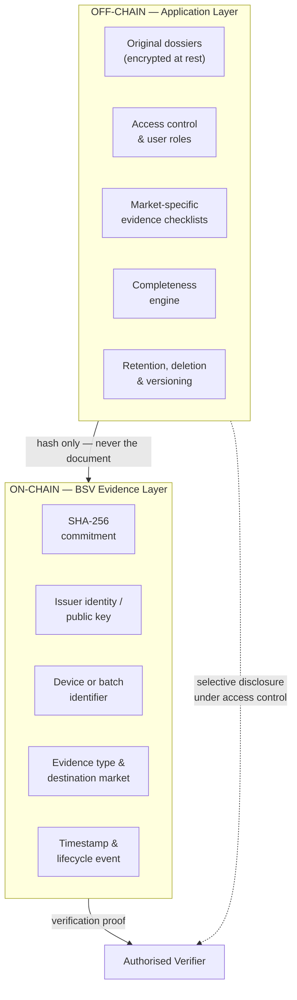
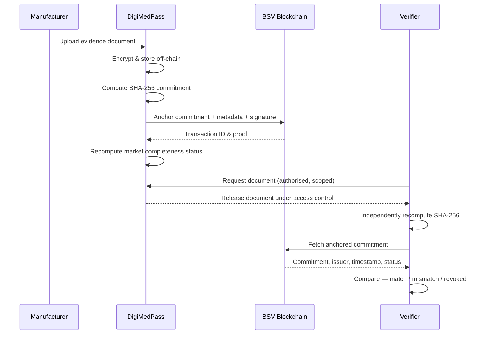

<div align="center">

# DigiMedPass

**A cryptographic evidence passport for cross-border medical device compliance.**

Confidential regulatory dossiers stay off-chain. Their cryptographic commitments, issuer identities, timestamps and lifecycle events are anchored to the BSV blockchain — so any authorised party can prove a document is authentic, current and unchanged without ever seeing its contents.

[](#project-status)
[](#why-bsv)
[](#evidence-anchoring)
[](#license)

[Overview](#overview) · [Problem](#the-problem) · [Architecture](#architecture) · [Getting Started](#getting-started) · [Data Model](#data-model) · [Roadmap](#roadmap) · [Team](#team)

</div>

---

## Project Status

> **This is a proof of concept, not a production system.**
>
> DigiMedPass does not replace regulators, notified bodies, authorised representatives or regulatory consultants, and it issues no legal declaration of conformity. It provides an independently verifiable evidence layer *beneath* existing regulatory processes. Nothing in this repository should be relied upon for an actual market-access submission.

---

## Overview

Medical-device supply chains move more than physical products. They move **regulatory evidence** — and that evidence has its own supply chain, running in parallel to the physical one, across organisational and jurisdictional boundaries.

Manufacturers, component suppliers, contract manufacturers, testing laboratories, quality and regulatory-affairs teams, notified bodies, authorised representatives, importers, distributors and national regulators all generate, exchange and verify documentation before a device can enter a market and remain on it. Today that exchange happens over email, vendor portals, consultant handoffs and disconnected internal databases.

DigiMedPass gives a device or batch a **digital evidence passport**: a single verifiable record of which regulatory evidence exists, who issued it, when, for which market, and whether it is still valid — without publishing any of the underlying confidential material.

### What it does

| Capability | Description |
|---|---|
| **Market-specific checklists** | Distinct evidence requirements per destination market (EU, US in the PoC) |
| **Document integrity** | SHA-256 commitment anchored on-chain; any byte-level change is detectable |
| **Provenance** | Issuer identity and cryptographic signature bound to each evidence record |
| **Timestamping** | Immutable proof of when evidence was submitted, reviewed or verified |
| **Completeness status** | Automatic per-market computation of whether required evidence is present |
| **Expiry & revocation** | Lifecycle events that collapse a previously valid status |
| **Independent verification** | A third party recomputes the hash and compares it to the chain, without needing access to your systems |

### What it explicitly does not do

- Store confidential dossiers on a public blockchain
- Implement the complete MDR, IVDR, FDA 21 CFR, PMDA, TGA or NMPA rule sets
- Integrate with EUDAMED, GUDID or any production regulatory database
- Make a legal determination that a device is compliant
- Provide production-grade identity, key custody or cybersecurity infrastructure

---

## The Problem

### 1. The parallel evidence supply chain

Alongside the physical device flows a stream of documentation: design records, quality-management system certificates, test and sterilisation reports, clinical evaluation, manufacturing records, unique device identifiers, declarations of conformity, market-registration evidence, audit trails and post-market surveillance data.

The core difficulty is not product tracking. It is **trusted evidence exchange across independent organisations and jurisdictions.**

### 2. The transparency–privacy tension

Regulation demands transparency. Commercial reality demands confidentiality. These pull in opposite directions.

| Regulatory transparency pressures | Privacy & confidentiality pressures |
|---|---|
| Traceability across the device lifecycle | Confidential technical and commercial information |
| Auditable evidence and timestamps | Selective disclosure to authorised parties only |
| Accountability for submissions and approvals | Controlled access and least privilege |
| Evidence provenance and version history | Data minimisation, retention and deletion obligations |

A naive blockchain approach — putting dossiers on-chain — resolves transparency by creating a disclosure breach. A fully private system resolves confidentiality by recreating the silo.

> **A public dossier is a breach. A private ledger is a silo. DigiMedPass anchors proof, not paperwork.**

### 3. Cross-border divergence

Medical-device regimes share safety objectives but differ in structure, classification, required actors, databases and submission pathways.

| Jurisdiction | Framework / authority | Additional complexity |
|---|---|---|
| European Union | EU MDR / IVDR | CE marking, notified bodies, EU economic operators, UDI, EUDAMED |
| United States | FDA / 21 CFR | Classification, listing, UDI/GUDID, market-authorisation pathway, QMS requirements |
| United Kingdom | MHRA | UK Responsible Person, registration requirements |
| Japan | PMD Act / PMDA | Local Marketing Authorization Holder, Japan-specific approval routes |
| Australia | TGA / ARTG | Australian sponsor, conformity evidence, ARTG inclusion |
| China | NMPA | Local agent, registration or filing, China-specific evidence and UDI |

Privacy law layers on top: GDPR where personal data is processed; HIPAA/HITECH in specific US covered relationships; and commercial confidentiality obligations that persist even where no personal data is involved.

---

## Architecture

DigiMedPass is a **hybrid on-chain / off-chain system**. The split is the entire design thesis.



**The invariant:** no confidential content, no personal data and no commercially sensitive material is ever written to the chain. Only commitments and metadata that are meaningless without the corresponding off-chain document.

### Verification flow



### Status model

```
Incomplete  →  Pending Review  →  Evidence Complete  →  Expired / Revoked
```

Status is computed **per destination market**, not per device. A device can be Evidence Complete for the EU and Incomplete for the US simultaneously — which is the normal state of affairs and the reason this problem is hard.

Any of the following collapse a previously valid status:

- A document hash no longer matches its on-chain commitment (tampering or substitution)
- An evidence item passes its expiry date
- An issuer records a revocation event
- A newly required checklist item is added for that market

---

## Why BSV

BSV was selected for the anchoring layer for reasons specific to this workload:

- **Transaction-based data anchoring.** The use case is evidence integrity and event history, which maps cleanly onto a transaction-oriented model rather than a general-purpose state machine.
- **Low, predictable per-anchor cost.** Regulatory evidence generates many small writes over a device's lifecycle. Cost per anchor materially affects whether the model is viable for SMEs.
- **SPV-style proof verification.** A verifier can confirm an anchor without operating full infrastructure.
- **Signatures and issuer identity** are native to the transaction model.
- **Existing supply-chain implementation patterns** reduce the amount of transaction and verification logic that has to be invented.

**Honest limitations.** BSV does not provide a confidential enterprise document repository. Storage, encryption, access control, key management and retention policy remain entirely application responsibilities. Existing supply-chain reference code also requires substantial adaptation for regulatory evidence semantics — issuer roles, market rules, expiry and revocation are not off-the-shelf.

---

## Tech Stack

| Layer | Technology |
|---|---|
| Framework | Next.js 14 (App Router) |
| Language | TypeScript |
| Styling | Tailwind CSS (hand-rolled primitives, no external component library) |
| Motion | Framer Motion |
| Hashing | Web Crypto API (SHA-256) — computed for real, client-side |
| Blockchain | BSV anchoring is **mocked** in this PoC (no funded wallet integration yet — see [Roadmap](#roadmap)) |
| Storage | None — evidence "documents" are demo fixtures in `lib/mock-data.ts`, held in memory |
| Auth | Session-based, `localStorage`-backed (mocked in the PoC, not a production auth system) |

**What's genuinely real vs. simulated in this build:** the SHA-256 hashing and hash-comparison logic runs for real in the browser via `crypto.subtle` — clicking "recompute & compare" or "verify" on a document actually re-hashes its content and checks it against the recorded commitment, and "simulate tampering" actually mutates the underlying content so that check genuinely fails. What's mocked is the BSV anchor itself (txids are deterministic placeholders, not broadcast transactions) and storage/auth (in-memory fixtures and `localStorage`, not a database or identity provider).

---

## Getting Started

### Prerequisites

- Node.js 18.17 or later
- npm

### Installation

```bash
git clone https://github.com/<org>/digimedpass.git
cd digimedpass
npm install
npm run dev
```

The application runs at `http://localhost:3000`. No environment variables, database or funded wallet are required — the PoC runs entirely on in-memory demo fixtures.

### Demo mode

The whole app runs against mock data, so the full workflow can be demonstrated without any live network access.

Demo credentials (either role): `demo@digimedpass.io` / `demo1234`

Mock fixtures live in `lib/mock-data.ts` and are designed to be edited immediately before a demonstration.

### Scripts

| Command | Purpose |
|---|---|
| `npm run dev` | Start the development server |
| `npm run build` | Production build |
| `npm run start` | Serve the production build |
| `npm run lint` | ESLint |

---

## Project Structure

```
digimedpass/
├── app/
│   ├── layout.tsx                # Root layout, fonts, SessionProvider
│   ├── page.tsx                  # Home — hero, architecture, live verification demo
│   ├── about/page.tsx
│   ├── team/page.tsx
│   ├── login/page.tsx            # Role-selecting mock auth
│   ├── dashboard/page.tsx        # Manufacturer device passport
│   └── regulator/page.tsx        # Read-only verifier console
├── components/
│   ├── ui/                       # button, badge, card, input primitives
│   ├── marketing/                # nav, footer, fade-up, live-verification-demo
│   └── dashboard/                # evidence-table, checklist-card, audit-timeline,
│                                  # status-badge, upload-panel, recompute-panel
├── lib/
│   ├── session.tsx               # localStorage-backed auth context
│   ├── hash.ts                   # Real SHA-256 via Web Crypto (crypto.subtle)
│   ├── mock-data.ts              # Demo device passports & evidence fixtures
│   └── types.ts
└── public/
```

---

## Data Model

### On-chain payload

The only data written to BSV. Kept deliberately minimal — every field must justify its presence.

```jsonc
{
  "v": 1,                                  // schema version
  "commitment": "a3f9c2...8e41d0",         // SHA-256 of the document
  "device": "DEV-2026-0417",               // device or batch identifier
  "market": "EU",                          // destination market
  "type": "QMS_CERTIFICATE",               // evidence category
  "issuer": "02a1b4...9f3c",               // issuer public key
  "event": "SUBMITTED",                    // lifecycle event
  "expires": "2028-04-17",                 // optional expiry date
  "prev": "b71e05...2a9f14"                // previous txid in this evidence chain
}
```

Note what is absent: no filename, no file contents, no company name, no personal data, no clinical information.

### Off-chain evidence record

The on-chain payload above is the target production shape. This PoC's actual TypeScript model
(`lib/types.ts`) is a deliberately simplified stand-in — no real storage layer or issuer PKI yet,
but the hashing and status semantics are real:

```typescript
interface EvidenceRecord {
  id: string;
  name: string;
  type: string;
  content: string;         // stand-in for the off-chain document; what actually gets hashed
  anchoredHash: string;    // SHA-256 of `content` at submission time — the "on-chain" commitment
  issuer: string;
  timestamp: string;
  txid: string;            // mocked BSV txid
  status: EvidenceStatus;
}

type EvidenceStatus = 'Verified' | 'Pending Review' | 'Tampered' | 'Revoked';

type MarketStatus = 'Evidence Complete' | 'Pending Review' | 'Incomplete' | 'Revoked';

type Market = 'EU' | 'US';     // PoC scope
```

### Evidence types

| Code | Description | EU | US |
|---|---|:--:|:--:|
| `QMS_CERTIFICATE` | Quality management system certification | ✅ | ✅ |
| `TECH_FILE` | Technical documentation / design record | ✅ | ✅ |
| `TEST_REPORT` | Bench, biocompatibility, electrical safety testing | ✅ | ✅ |
| `STERILISATION_REPORT` | Sterilisation validation | ✅ | ✅ |
| `CLINICAL_EVALUATION` | Clinical evaluation report | ✅ | — |
| `DECLARATION_CONFORMITY` | Declaration of conformity | ✅ | — |
| `UDI_RECORD` | Unique device identifier assignment | ✅ | ✅ |
| `EU_REP_MANDATE` | Authorised representative mandate | ✅ | — |
| `FDA_LISTING` | Establishment registration & device listing | — | ✅ |
| `PREMARKET_SUBMISSION` | 510(k) / De Novo / PMA evidence | — | ✅ |

This table documents the full conceptual evidence taxonomy for EU/US. The running demo wires up a representative subset (QMS certificate, test report, declaration of conformity, UDI record, sterilisation validation) as `ChecklistItem`s in `lib/mock-data.ts` — extending the checklist to the remaining types is a matter of adding fixtures, not new architecture.

---

## Demonstration Scenario

The reference walkthrough, showing every mechanism in sequence:

1. A manufacturer registers one sterile medical-device batch
2. EU and US are selected as destination markets — both show **Incomplete**
3. Quality, testing, identification and market-access evidence is uploaded
4. Each file is hashed and its commitment anchored to BSV
5. **EU reaches Evidence Complete**; US remains Incomplete, missing one market-specific item
6. The missing US evidence is added — **both markets reach Evidence Complete**
7. A verifier independently recomputes a document hash, confirms the match against the chain, and reads the audit timeline
8. One document is modified — the system detects the commitment mismatch and **collapses the affected market status**
9. One document is revoked by its issuer — the revocation event is anchored and the status collapses again

---

## Prior Art

Blockchain in healthcare and medical-device supply chains is not theoretical. Existing deployments validate the underlying need while clarifying the specific gap DigiMedPass addresses.

| Solution | Sector | Primary focus | Gap relative to DigiMedPass |
|---|---|---|---|
| Boston Scientific / CORNERSTONE / IBM | Medical devices | Inventory visibility, order processing, digitised documents, shared supply-chain transactions | No multi-jurisdiction regulatory-evidence mapping or evidence passport |
| MediLedger / Chronicled | Pharmaceuticals | Contract alignment, roster communication, settlement, product verification, DSCSA tracing | Primarily pharmaceutical, US-specific, centred on drug tracing |
| Academic MedTech prototypes | Devices & healthcare | Traceability, procurement, distributed manufacturing, record integrity | Typically single-purpose or single-jurisdiction |
| **DigiMedPass** | Medical devices | Cross-border regulatory-evidence passport, off-chain dossiers, BSV verification | Early proof of concept; no legally authoritative determination |

The absence of a comprehensive solution should not be read as absence of need — the opposite. These deployments demonstrate that organisations already invest in blockchain for supply-chain visibility and selected regulatory requirements. The remaining gap is narrower: no identified mature platform combines cross-border requirement mapping, confidential off-chain dossiers, public-chain integrity verification, authorised submission, expiry and revocation, and per-market completeness in a single SME-oriented workflow.

The shift is from **tracking products and orders** to **managing reusable, privacy-aware regulatory evidence**.

---

## Economic Model

The claim is deliberately bounded. DigiMedPass does not eliminate regulators, notified bodies, authorised representatives or regulatory consultants — several of those roles are legally required or depend on expert judgement.

The defensible claim is a reduction in **repetitive evidence administration**: document collection, version checking, reconciliation and routine cross-organisational exchange. Consultants become users and partners of the platform rather than a cost to be removed.

**Regulatory Evidence as a Service**, priced along four possible axes:

| Model | Basis |
|---|---|
| SME subscription | Per organisation, per month |
| Per-device | Per registered device or batch passport |
| Per-submission | Per evidence item anchored |
| Per-verification | Per external verification request served |

---

## Roadmap

**Current — Proof of Concept**
- [x] Hybrid on-chain / off-chain architecture (demonstrated in UI/UX; anchoring itself is mocked)
- [x] Real SHA-256 commitment hashing and recompute-and-compare, client-side
- [x] EU and US evidence checklists
- [x] Per-market completeness display
- [x] Independent verifier interface (regulator role, read-only, per-record recompute)
- [x] Expiry and revocation lifecycle (simulated)
- [x] Tampering detection (genuine — mutates content, hash comparison genuinely fails)

**Next**
- [ ] Real BSV testnet anchoring (funded wallet, actual broadcast transactions, SPV proof retrieval)
- [ ] Real off-chain storage with encryption at rest, replacing in-memory fixtures
- [ ] Real authentication, replacing the `localStorage` demo session
- [ ] Additional jurisdictions — UK (MHRA), Japan (PMDA), Australia (TGA), China (NMPA)
- [ ] Selective disclosure via zero-knowledge proofs, so a verifier can confirm a property of a document without receiving it
- [ ] Multi-party issuer signatures for notified body and laboratory countersigning
- [ ] Merkle batching to reduce per-anchor cost at volume
- [ ] Production key management and hardware-backed custody
- [ ] Read-only integration exploration with EUDAMED and GUDID
- [ ] Formal retention and right-to-erasure handling for the off-chain layer

---

## Contributing

This is an early-stage research prototype. Issues and discussion are welcome, particularly on:

- Evidence-schema design and on-chain payload minimisation
- Market requirement matrices for jurisdictions not yet covered
- Privacy analysis of the on-chain metadata surface
- Verification UX for non-technical regulatory-affairs users

Please open an issue before submitting substantial pull requests.

---

## Team

| | Focus |
|---|---|
| **Bryan** | Technical lead, blockchain architecture, anchoring and verification layer |
| **Sian** | Regulatory research, cross-jurisdiction compliance mapping |
| **Sana** | Product strategy, market analysis, positioning |
| **Pirnavan** | Systems engineering, evidence status and verification logic |
| **Yuxuan** | Design, economic modelling |

---

## Security

The threat model for this prototype is deliberately incomplete. Known gaps:

- Anchoring keys are held in environment configuration, not hardware custody
- No formal audit of the encryption or access-control implementation has been performed
- On-chain metadata (device identifiers, evidence types, timing patterns) constitutes an observable surface that could permit inference about a manufacturer's regulatory activity even without document access — this is an open design question, not a solved one

Do not process real patient data, real commercially confidential dossiers or production regulatory evidence with this codebase.

To report a security issue, open a private security advisory rather than a public issue.

---

## References

- World Health Organization (2024) *Medical devices*
- European Parliament and Council (2017) *Regulation (EU) 2017/745 (MDR)* and *2017/746 (IVDR)*
- US Food and Drug Administration — *21 CFR* device regulation
- McDermott, O., Foley, I., Antony, J., Sony, M. and Butler, M. (2022) 'The impact of Industry 4.0 on the medical device regulatory product life cycle compliance', *Sustainability*, 14(21), 14650
- Marathe, Chung and Hill (2023) — blockchain for cross-organisational healthcare supply chains
- Han, Ceross and Bergmann (2024) — cross-border medical device regulation and privacy
- IBM (2020) — Boston Scientific / CORNERSTONE blockchain supply-chain pilot
- US Food and Drug Administration (2023) — DSCSA blockchain pilot findings
- BSV Association — supply-chain reference architecture and SPV documentation

---

## License

MIT. See [`LICENSE`](LICENSE).

<div align="center">
<br/>

**DigiMedPass** — anchor proof, not paperwork.

</div>
