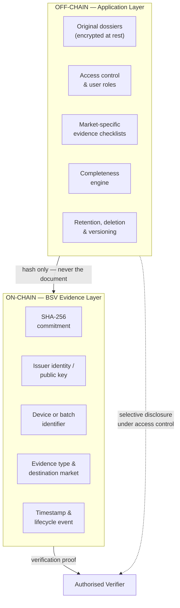
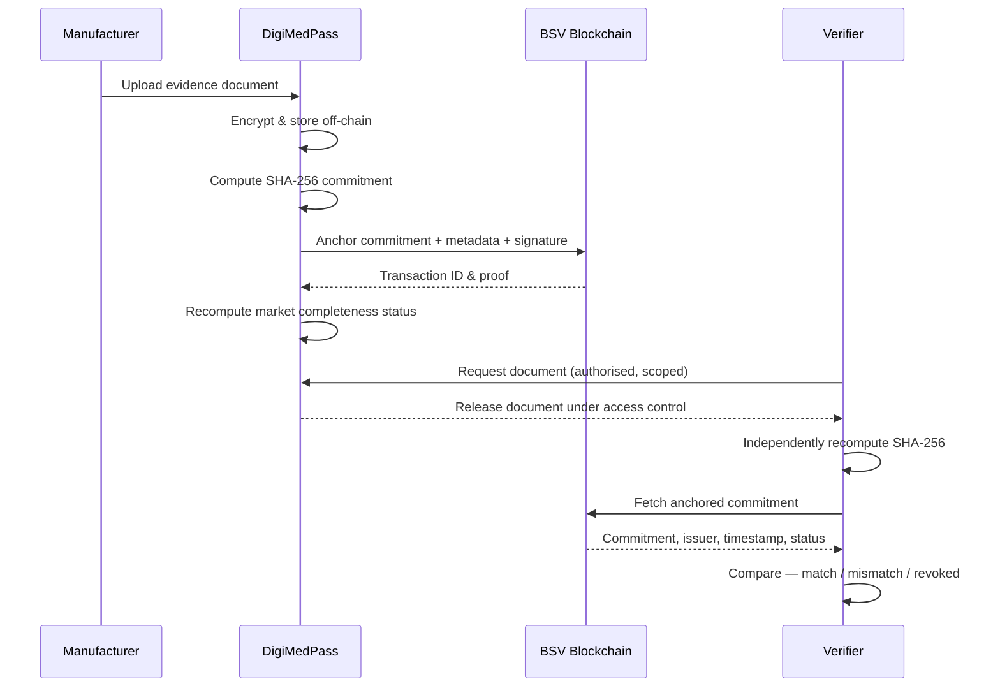

<div align="center">

# DigiMedPass

**A cryptographic evidence passport for cross-border medical device compliance.**

Confidential regulatory dossiers stay off-chain. Their cryptographic commitments, issuer identities, timestamps and lifecycle events are anchored to the BSV blockchain — so any authorised party can prove a document is authentic, current and unchanged without ever seeing its contents.

[](#project-status)
[](#why-bsv)
[](#evidence-anchoring)
[](#license)

[Overview](#overview) · [Problem](#the-problem) · [Architecture](#architecture) · [Getting Started](#getting-started) · [Data Model](#data-model) · [Roadmap](#roadmap) · [Team](#team)

</div>

---

## Project Status

> **This is a proof of concept, not a production system.**
>
> DigiMedPass does not replace regulators, notified bodies, authorised representatives or regulatory consultants, and it issues no legal declaration of conformity. It provides an independently verifiable evidence layer *beneath* existing regulatory processes. Nothing in this repository should be relied upon for an actual market-access submission.

---

## Overview

Medical-device supply chains move more than physical products. They move **regulatory evidence** — and that evidence has its own supply chain, running in parallel to the physical one, across organisational and jurisdictional boundaries.

Manufacturers, component suppliers, contract manufacturers, testing laboratories, quality and regulatory-affairs teams, notified bodies, authorised representatives, importers, distributors and national regulators all generate, exchange and verify documentation before a device can enter a market and remain on it. Today that exchange happens over email, vendor portals, consultant handoffs and disconnected internal databases.

DigiMedPass gives a device or batch a **digital evidence passport**: a single verifiable record of which regulatory evidence exists, who issued it, when, for which market, and whether it is still valid — without publishing any of the underlying confidential material.

### What it does

| Capability | Description |
|---|---|
| **Market-specific checklists** | Distinct evidence requirements per destination market (EU, US in the PoC) |
| **Document integrity** | SHA-256 commitment anchored on-chain; any byte-level change is detectable |
| **Provenance** | Issuer identity and cryptographic signature bound to each evidence record |
| **Timestamping** | Immutable proof of when evidence was submitted, reviewed or verified |
| **Completeness status** | Automatic per-market computation of whether required evidence is present |
| **Expiry & revocation** | Lifecycle events that collapse a previously valid status |
| **Independent verification** | A third party recomputes the hash and compares it to the chain, without needing access to your systems |

### What it explicitly does not do

- Store confidential dossiers on a public blockchain
- Implement the complete MDR, IVDR, FDA 21 CFR, PMDA, TGA or NMPA rule sets
- Integrate with EUDAMED, GUDID or any production regulatory database
- Make a legal determination that a device is compliant
- Provide production-grade identity, key custody or cybersecurity infrastructure

---

## The Problem

### 1. The parallel evidence supply chain

Alongside the physical device flows a stream of documentation: design records, quality-management system certificates, test and sterilisation reports, clinical evaluation, manufacturing records, unique device identifiers, declarations of conformity, market-registration evidence, audit trails and post-market surveillance data.

The core difficulty is not product tracking. It is **trusted evidence exchange across independent organisations and jurisdictions.**

### 2. The transparency–privacy tension

Regulation demands transparency. Commercial reality demands confidentiality. These pull in opposite directions.

| Regulatory transparency pressures | Privacy & confidentiality pressures |
|---|---|
| Traceability across the device lifecycle | Confidential technical and commercial information |
| Auditable evidence and timestamps | Selective disclosure to authorised parties only |
| Accountability for submissions and approvals | Controlled access and least privilege |
| Evidence provenance and version history | Data minimisation, retention and deletion obligations |

A naive blockchain approach — putting dossiers on-chain — resolves transparency by creating a disclosure breach. A fully private system resolves confidentiality by recreating the silo.

> **A public dossier is a breach. A private ledger is a silo. DigiMedPass anchors proof, not paperwork.**

### 3. Cross-border divergence

Medical-device regimes share safety objectives but differ in structure, classification, required actors, databases and submission pathways.

| Jurisdiction | Framework / authority | Additional complexity |
|---|---|---|
| European Union | EU MDR / IVDR | CE marking, notified bodies, EU economic operators, UDI, EUDAMED |
| United States | FDA / 21 CFR | Classification, listing, UDI/GUDID, market-authorisation pathway, QMS requirements |
| United Kingdom | MHRA | UK Responsible Person, registration requirements |
| Japan | PMD Act / PMDA | Local Marketing Authorization Holder, Japan-specific approval routes |
| Australia | TGA / ARTG | Australian sponsor, conformity evidence, ARTG inclusion |
| China | NMPA | Local agent, registration or filing, China-specific evidence and UDI |

Privacy law layers on top: GDPR where personal data is processed; HIPAA/HITECH in specific US covered relationships; and commercial confidentiality obligations that persist even where no personal data is involved.

---

## Architecture

DigiMedPass is a **hybrid on-chain / off-chain system**. The split is the entire design thesis.



**The invariant:** no confidential content, no personal data and no commercially sensitive material is ever written to the chain. Only commitments and metadata that are meaningless without the corresponding off-chain document.

### Verification flow



### Status model

```
Incomplete  →  Pending Review  →  Evidence Complete  →  Expired / Revoked
```

Status is computed **per destination market**, not per device. A device can be Evidence Complete for the EU and Incomplete for the US simultaneously — which is the normal state of affairs and the reason this problem is hard.

Any of the following collapse a previously valid status:

- A document hash no longer matches its on-chain commitment (tampering or substitution)
- An evidence item passes its expiry date
- An issuer records a revocation event
- A newly required checklist item is added for that market

---

## Why BSV

BSV was selected for the anchoring layer for reasons specific to this workload:

- **Transaction-based data anchoring.** The use case is evidence integrity and event history, which maps cleanly onto a transaction-oriented model rather than a general-purpose state machine.
- **Low, predictable per-anchor cost.** Regulatory evidence generates many small writes over a device's lifecycle. Cost per anchor materially affects whether the model is viable for SMEs.
- **SPV-style proof verification.** A verifier can confirm an anchor without operating full infrastructure.
- **Signatures and issuer identity** are native to the transaction model.
- **Existing supply-chain implementation patterns** reduce the amount of transaction and verification logic that has to be invented.

**Honest limitations.** BSV does not provide a confidential enterprise document repository. Storage, encryption, access control, key management and retention policy remain entirely application responsibilities. Existing supply-chain reference code also requires substantial adaptation for regulatory evidence semantics — issuer roles, market rules, expiry and revocation are not off-the-shelf.

---

## Tech Stack

| Layer | Technology |
|---|---|
| Framework | Next.js 14 (App Router), including server-side API routes |
| Language | TypeScript |
| Styling | Tailwind CSS (hand-rolled primitives, no external component library) |
| Motion | Framer Motion |
| Hashing | Web Crypto API (SHA-256) — computed for real, client-side |
| Blockchain | Real BSV **testnet** anchoring via [`@bsv/sdk`](https://www.npmjs.com/package/@bsv/sdk) and the [WhatsOnChain](https://test.whatsonchain.com) API — see [BSV Anchoring](#bsv-anchoring) |
| Storage | None — evidence "documents" are demo fixtures in `lib/mock-data.ts`; live edits are held in a `localStorage`-backed store (`lib/evidence-store.tsx`) shared by both roles |
| Auth | Session-based, `sessionStorage`-backed — deliberately **per-tab**, not per-browser (see below), and mocked, not a production auth system |

**What's genuinely real in this build:** SHA-256 hashing and hash-comparison run for real in the browser via `crypto.subtle`. And as of this pass, so does the anchor itself — submitting evidence, approving a record, and revoking a document each build, sign and broadcast a real BSV testnet transaction with an `OP_RETURN` evidence-commitment payload, server-side, via `/api/anchor`. The resulting txid is real and independently checkable on a public block explorer (see below) — nothing about that step is simulated. What's still mocked is storage and auth (a `localStorage`-backed fixture store, not a database or identity provider) — and the seed/demo data the app boots with (`lib/mock-data.ts`), which carries short placeholder txids from before this pass, not real ones.

**The manufacturer and regulator dashboards are connected, not two disconnected demos.** Both read and write the same `lib/evidence-store.tsx` state. When a manufacturer submits evidence, it's immediately visible to a regulator browsing that device passport; when a regulator approves a pending record, the manufacturer sees the status flip and a new audit-timeline entry — live, without a page reload, via the browser's `storage` event. To see both sides at once: sign in as manufacturer in one tab, then open `/login` in a second tab and sign in as regulator. This works because session identity lives in `sessionStorage` (per-tab) while evidence data lives in `localStorage` (shared across tabs of the same browser) — so the two roles can be active simultaneously without one signing the other out.

---

## BSV Anchoring

Every lifecycle event a manufacturer or regulator triggers — submit, approve, reject, revoke — builds and broadcasts a real BSV testnet transaction:

```
Manufacturer/Regulator action
  → POST /api/anchor  (Next.js Route Handler, server-only)
    → lib/bsv/anchor.ts: fetch UTXOs for the anchoring address (WhatsOnChain)
    → build a Transaction: spend all UTXOs, one OP_RETURN output (the payload),
      one change output back to the same address
    → sign with the server-only private key, broadcast (WhatsOnChain)
  ← { txid }
```

The transaction carries the same minimal on-chain payload documented under [Data Model](#data-model) — `commitment`, `device`, `market`, `type`, `issuer`, `event`, and `prev` (the previous txid in that record's lifecycle, chaining submit → verify/revoke). Nothing else. Each anchor spends every UTXO on the wallet and returns change to itself, so the wallet self-consolidates back to a single UTXO after every anchor — simple, and enough for this PoC's anchor volume.

Every txid shown in the app — in the evidence table and the audit timeline — is a **"View on-chain ↗"** link straight to [WhatsOnChain's testnet explorer](https://test.whatsonchain.com). That's the point: you don't have to trust DigiMed's UI. Anyone can open the link and read the raw transaction and its `OP_RETURN` payload themselves, independent of this app entirely. `GET /api/anchor/{txid}` does the same lookup server-side — it re-fetches the transaction fresh from the chain and decodes the payload, rather than trusting anything cached locally.

**Setup** (see `.env.example`):

```bash
BSV_NETWORK=test              # test | main — this PoC has only ever been used on testnet
BSV_PRIVATE_KEY=               # WIF-format testnet private key for the anchoring wallet
BSV_FEE_RATE=0.05              # satoshis per byte
```

Generate a key (never commit it — `.env.local` is gitignored):

```bash
node -e "
const { PrivateKey } = require('@bsv/sdk');
const pk = PrivateKey.fromRandom();
console.log('WIF:', pk.toWif([0xef]));
console.log('Address:', pk.toAddress([0x6f]));
"
```

Fund the printed address with a small amount of testnet BSV from a faucet before anchoring will succeed — until it's funded (or `BSV_PRIVATE_KEY` isn't set at all), anchor attempts fail with a clear, visible error in the UI rather than a silent fake success. That's deliberate: a "proof of compliance" system that quietly pretends to anchor when it can't would defeat the entire point.

`BSV_PRIVATE_KEY` is read only in server-side code (`lib/bsv/`, guarded by the `server-only` package so an accidental client import fails the build) and is never sent to the browser or logged.

---

## Document Upload Pipeline

The manufacturer dashboard's upload panel is a real file picker (click-to-browse or drag-and-drop, `components/dashboard/document-upload.tsx`) — not a canned demo button. Uploading a document:

1. **Choose a file, an evidence type, and destination market(s).** The type list (`lib/evidence-types.ts`) is the full taxonomy from [Evidence types](#evidence-types) below; the market checkboxes only offer markets that type is actually relevant to (e.g. Declaration of Conformity is EU-only).
2. **The file's actual bytes are hashed** with `crypto.subtle.digest`, client-side — the SHA-256 commitment is computed from what you dropped in, not a placeholder string.
3. **The hash is anchored for real** via `POST /api/anchor` with `event: "SUBMITTED"`, exactly as described above.
4. On success, the record appears as **Pending Review** in the evidence table, and — because a regulator's dashboard reads the same shared store — is immediately visible there too, ready for a decision.

**There's no off-chain storage backend in this PoC** (see [What's genuinely real](#tech-stack)), so a document's bytes are kept as a hex-encoded string in the same `localStorage`-backed evidence record its metadata lives in. That keeps "recompute & compare" genuinely meaningful for uploaded files too — not just the seed fixtures — since the exact bytes are still there to re-hash. It does mean uploads are capped at **1 MB** (`MAX_FILE_BYTES` in `document-upload.tsx`) to stay well inside typical `localStorage` quotas; anything larger is rejected client-side with a clear message before it ever reaches the network.

**The regulator decides: approve or reject.** Every Pending Review record gets both buttons. Approving anchors a `VERIFIED` event and flips status to Verified; rejecting anchors a `REJECTED` event and flips status to Rejected — both reference the submission's txid as `prev`, so the full submit → decision chain is walkable on-chain. Whichever it is, the decision is visible to the manufacturer live, same as everything else in this store.

---

## Getting Started

### Prerequisites

- Node.js 18.17 or later
- npm

### Installation

```bash
git clone https://github.com/<org>/digimedpass.git
cd digimedpass
npm install
cp .env.example .env.local   # then fill in a funded BSV_PRIVATE_KEY — see BSV Anchoring
npm run dev
```

The application runs at `http://localhost:3000`. No database is required — the PoC runs against in-memory demo fixtures for everything except the BSV anchor itself, which needs the funded testnet key described under [BSV Anchoring](#bsv-anchoring). Without it, the app still runs fully — every screen renders and the local hashing/verification demos work — but manufacturer/regulator actions that anchor (submit, approve, revoke) will show a clear error instead of succeeding.

### Demo mode

The app boots with mock evidence data (`lib/mock-data.ts`), so browsing and the local hash-verification demos work without any live network access or a funded wallet. Actions that anchor a new event on-chain do need the network and a funded key (see [BSV Anchoring](#bsv-anchoring)).

Demo credentials (either role): `demo@digimedpass.io` / `demo1234`

Mock fixtures live in `lib/mock-data.ts` and are designed to be edited immediately before a demonstration.

### Scripts

| Command | Purpose |
|---|---|
| `npm run dev` | Start the development server |
| `npm run build` | Production build |
| `npm run start` | Serve the production build |
| `npm run lint` | ESLint |

---

## Project Structure

```
digimedpass/
├── app/
│   ├── layout.tsx                # Root layout, fonts, SessionProvider
│   ├── page.tsx                  # Home — hero, architecture, live verification demo
│   ├── about/page.tsx
│   ├── team/page.tsx
│   ├── login/page.tsx            # Role-selecting mock auth
│   ├── dashboard/page.tsx        # Manufacturer device passport
│   ├── regulator/page.tsx        # Verifier console
│   └── api/anchor/
│       ├── route.ts              # POST — build, sign, broadcast a real BSV anchor
│       └── [txid]/route.ts       # GET — re-fetch + decode a txid straight from the chain
├── components/
│   ├── ui/                       # button, badge, card, input primitives
│   ├── marketing/                # nav, footer, fade-up, live-verification-demo
│   ├── dashboard/                # evidence-table, checklist-card, audit-timeline,
│   │                              # status-badge, document-upload, recompute-panel
│   └── illustrations/            # brand-matched SVG art (node-lattice, hash-chain,
│                                  # globe-circuit, hex-field, avatar-glyph, icons)
├── lib/
│   ├── session.tsx               # sessionStorage-backed auth context (per-tab)
│   ├── evidence-store.tsx        # localStorage-backed shared state — the seam
│   │                              # connecting the manufacturer and regulator views
│   ├── evidence-types.ts         # The evidence taxonomy (README's table, below)
│   ├── anchor-client.ts          # Client-safe fetch() wrapper around /api/anchor
│   ├── bsv/
│   │   ├── keys.ts               # server-only — loads BSV_PRIVATE_KEY
│   │   ├── anchor.ts             # server-only — UTXO fetch, build/sign/broadcast tx
│   │   ├── verify.ts             # server-only — fetch + decode a txid's OP_RETURN
│   │   ├── payload.ts            # On-chain payload encode/decode (client + server safe)
│   │   └── explorer.ts           # isRealTxid() / explorerTxUrl() (client-safe)
│   ├── hash.ts                   # Real SHA-256 via Web Crypto (crypto.subtle)
│   ├── mock-data.ts              # Demo device passports & evidence fixtures
│   └── types.ts
└── public/
```

---

## Data Model

### On-chain payload

The only data written to BSV, as a single `OP_RETURN` output — kept deliberately minimal, every
field must justify its presence. This is the actual shape `lib/bsv/payload.ts`'s `AnchorPayload`
encodes and `POST /api/anchor` broadcasts — not just a target design:

```jsonc
{
  "v": 1,                                  // schema version
  "commitment": "a3f9c2...8e41d0",         // SHA-256 of the document
  "device": "DEV-2026-0417",               // device or batch identifier
  "market": "EU",                          // destination market
  "type": "QMS_CERTIFICATE",               // evidence category
  "issuer": "Acme MedTech",                // issuer name (a real system would use a public key)
  "event": "SUBMITTED",                    // lifecycle event: SUBMITTED | VERIFIED | REVOKED
  "prev": "b71e05...2a9f14"                // optional — previous txid in this evidence chain
}
```

Note what is absent: no filename, no file contents, no company name beyond the issuer label, no
personal data, no clinical information. (Expiry dates and public-key issuer identity are documented
in the [Roadmap](#roadmap) but not yet wired into the payload — `issuer` is a plain name today.)

### Off-chain evidence record

The in-memory TypeScript model (`lib/types.ts`) the UI reads from — no real storage layer or issuer
PKI yet, but the hashing and anchoring are real:

```typescript
interface EvidenceRecord {
  id: string;
  name: string;
  type: string;
  content: string;              // what actually gets hashed — plain text for seed fixtures,
                                 // hex-encoded real file bytes for uploads (see contentEncoding)
  contentEncoding?: 'utf8' | 'hex';
  fileName?: string;
  fileSize?: number;
  anchoredHash: string;         // SHA-256 of `content` at submission time — the "on-chain" commitment
  issuer: string;
  timestamp: string;
  txid: string;                 // a real 64-hex BSV txid once anchored; seed/demo rows carry a short placeholder
  status: EvidenceStatus;
}

type EvidenceStatus = 'Verified' | 'Pending Review' | 'Tampered' | 'Revoked' | 'Rejected';

type MarketStatus = 'Evidence Complete' | 'Pending Review' | 'Incomplete' | 'Revoked';

type Market = 'EU' | 'US';     // PoC scope
```

### Evidence types

| Code | Description | EU | US |
|---|---|:--:|:--:|
| `QMS_CERTIFICATE` | Quality management system certification | ✅ | ✅ |
| `TECH_FILE` | Technical documentation / design record | ✅ | ✅ |
| `TEST_REPORT` | Bench, biocompatibility, electrical safety testing | ✅ | ✅ |
| `STERILISATION_REPORT` | Sterilisation validation | ✅ | ✅ |
| `CLINICAL_EVALUATION` | Clinical evaluation report | ✅ | — |
| `DECLARATION_CONFORMITY` | Declaration of conformity | ✅ | — |
| `UDI_RECORD` | Unique device identifier assignment | ✅ | ✅ |
| `EU_REP_MANDATE` | Authorised representative mandate | ✅ | — |
| `FDA_LISTING` | Establishment registration & device listing | — | ✅ |
| `PREMARKET_SUBMISSION` | 510(k) / De Novo / PMA evidence | — | ✅ |

This table documents the full conceptual evidence taxonomy for EU/US. The running demo wires up a representative subset (QMS certificate, test report, declaration of conformity, UDI record, sterilisation validation) as `ChecklistItem`s in `lib/mock-data.ts` — extending the checklist to the remaining types is a matter of adding fixtures, not new architecture.

---

## Demonstration Scenario

The reference walkthrough, showing every mechanism in sequence:

1. A manufacturer registers one sterile medical-device batch
2. EU and US are selected as destination markets — both show **Incomplete**
3. Quality, testing, identification and market-access evidence is uploaded
4. Each file is hashed and its commitment anchored to BSV
5. **EU reaches Evidence Complete**; US remains Incomplete, missing one market-specific item
6. The missing US evidence is added — **both markets reach Evidence Complete**
7. A verifier independently recomputes a document hash, confirms the match against the chain, and reads the audit timeline
8. One document is modified — the system detects the commitment mismatch and **collapses the affected market status**
9. One document is revoked by its issuer — the revocation event is anchored and the status collapses again

---

## Prior Art

Blockchain in healthcare and medical-device supply chains is not theoretical. Existing deployments validate the underlying need while clarifying the specific gap DigiMedPass addresses.

| Solution | Sector | Primary focus | Gap relative to DigiMedPass |
|---|---|---|---|
| Boston Scientific / CORNERSTONE / IBM | Medical devices | Inventory visibility, order processing, digitised documents, shared supply-chain transactions | No multi-jurisdiction regulatory-evidence mapping or evidence passport |
| MediLedger / Chronicled | Pharmaceuticals | Contract alignment, roster communication, settlement, product verification, DSCSA tracing | Primarily pharmaceutical, US-specific, centred on drug tracing |
| Academic MedTech prototypes | Devices & healthcare | Traceability, procurement, distributed manufacturing, record integrity | Typically single-purpose or single-jurisdiction |
| **DigiMedPass** | Medical devices | Cross-border regulatory-evidence passport, off-chain dossiers, BSV verification | Early proof of concept; no legally authoritative determination |

The absence of a comprehensive solution should not be read as absence of need — the opposite. These deployments demonstrate that organisations already invest in blockchain for supply-chain visibility and selected regulatory requirements. The remaining gap is narrower: no identified mature platform combines cross-border requirement mapping, confidential off-chain dossiers, public-chain integrity verification, authorised submission, expiry and revocation, and per-market completeness in a single SME-oriented workflow.

The shift is from **tracking products and orders** to **managing reusable, privacy-aware regulatory evidence**.

---

## Economic Model

The claim is deliberately bounded. DigiMedPass does not eliminate regulators, notified bodies, authorised representatives or regulatory consultants — several of those roles are legally required or depend on expert judgement.

The defensible claim is a reduction in **repetitive evidence administration**: document collection, version checking, reconciliation and routine cross-organisational exchange. Consultants become users and partners of the platform rather than a cost to be removed.

**Regulatory Evidence as a Service**, priced along four possible axes:

| Model | Basis |
|---|---|
| SME subscription | Per organisation, per month |
| Per-device | Per registered device or batch passport |
| Per-submission | Per evidence item anchored |
| Per-verification | Per external verification request served |

---

## Roadmap

**Current — Proof of Concept**
- [x] Hybrid on-chain / off-chain architecture
- [x] Real SHA-256 commitment hashing and recompute-and-compare, client-side
- [x] Real BSV testnet anchoring — submit, approve and revoke each broadcast a genuine transaction; see [BSV Anchoring](#bsv-anchoring)
- [x] EU and US evidence checklists
- [x] Per-market completeness display
- [x] Independent verifier interface (regulator role, per-record recompute, and record approval)
- [x] Expiry and revocation lifecycle
- [x] Tampering detection (genuine — mutates content, hash comparison genuinely fails)
- [x] Manufacturer and regulator dashboards connected via a shared, live-synced evidence store — a regulator's approval is immediately visible to the manufacturer, and vice versa

**Next**
- [ ] SPV proof retrieval / merkle-path verification, rather than trusting a single indexer (WhatsOnChain) for confirmation status
- [ ] Real off-chain storage with encryption at rest, replacing the `localStorage`-backed evidence store
- [ ] Real authentication, replacing the `sessionStorage` demo session
- [ ] UTXO selection/locking to make concurrent anchor requests safe (currently spends all UTXOs per anchor, which a real backend would need to serialize)
- [ ] Additional jurisdictions — UK (MHRA), Japan (PMDA), Australia (TGA), China (NMPA)
- [ ] Selective disclosure via zero-knowledge proofs, so a verifier can confirm a property of a document without receiving it
- [ ] Multi-party issuer signatures for notified body and laboratory countersigning
- [ ] Merkle batching to reduce per-anchor cost at volume
- [ ] Production key management and hardware-backed custody
- [ ] Read-only integration exploration with EUDAMED and GUDID
- [ ] Formal retention and right-to-erasure handling for the off-chain layer

---

## Contributing

This is an early-stage research prototype. Issues and discussion are welcome, particularly on:

- Evidence-schema design and on-chain payload minimisation
- Market requirement matrices for jurisdictions not yet covered
- Privacy analysis of the on-chain metadata surface
- Verification UX for non-technical regulatory-affairs users

Please open an issue before submitting substantial pull requests.

---

## Team

| | Focus |
|---|---|
| **Bryan** | Technical lead, blockchain architecture, anchoring and verification layer |
| **Sian** | Regulatory research, cross-jurisdiction compliance mapping |
| **Sana** | Product strategy, market analysis, positioning |
| **Pirnavan** | Systems engineering, evidence status and verification logic |
| **Yuxuan** | Design, economic modelling |

---

## Security

The threat model for this prototype is deliberately incomplete. Known gaps:

- Anchoring keys are held in environment configuration, not hardware custody
- `/api/anchor` has no authentication or rate limiting of its own — the app's login is a client-side demo, not a real auth boundary, so anyone who can reach the deployed URL can trigger a real (testnet) broadcast. Low real-world stakes since testnet coins are worthless, but a funded wallet could be drained by repeated calls faster than a faucet can refill it
- No UTXO locking: `lib/bsv/anchor.ts` fetches and spends all available UTXOs per call with no serialization, so two anchor requests firing at nearly the same instant can race for the same UTXO — one broadcasts, the other fails with a clear error (never silently). A production version needs a proper UTXO/nonce manager
- No formal audit of the encryption or access-control implementation has been performed
- On-chain metadata (device identifiers, evidence types, timing patterns) constitutes an observable surface that could permit inference about a manufacturer's regulatory activity even without document access — this is an open design question, not a solved one

Do not process real patient data, real commercially confidential dossiers or production regulatory evidence with this codebase.

To report a security issue, open a private security advisory rather than a public issue.

---

## References

- World Health Organization (2024) *Medical devices*
- European Parliament and Council (2017) *Regulation (EU) 2017/745 (MDR)* and *2017/746 (IVDR)*
- US Food and Drug Administration — *21 CFR* device regulation
- McDermott, O., Foley, I., Antony, J., Sony, M. and Butler, M. (2022) 'The impact of Industry 4.0 on the medical device regulatory product life cycle compliance', *Sustainability*, 14(21), 14650
- Marathe, Chung and Hill (2023) — blockchain for cross-organisational healthcare supply chains
- Han, Ceross and Bergmann (2024) — cross-border medical device regulation and privacy
- IBM (2020) — Boston Scientific / CORNERSTONE blockchain supply-chain pilot
- US Food and Drug Administration (2023) — DSCSA blockchain pilot findings
- BSV Association — supply-chain reference architecture and SPV documentation

---

## License

MIT. See [`LICENSE`](LICENSE).

<div align="center">
<br/>

**DigiMedPass** — anchor proof, not paperwork.

</div>
